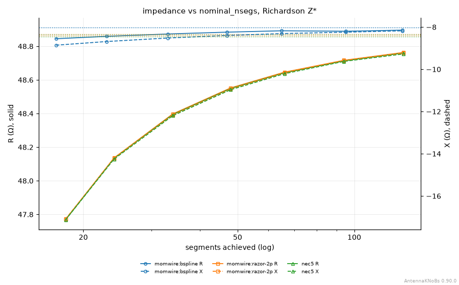
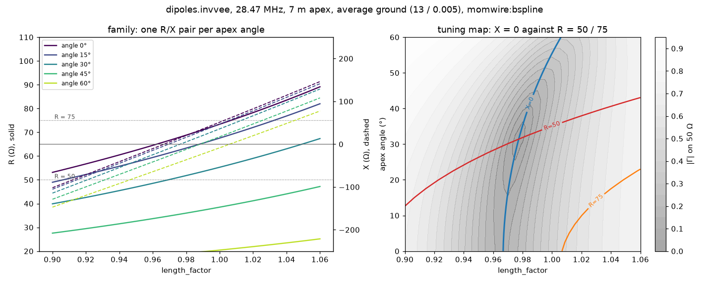
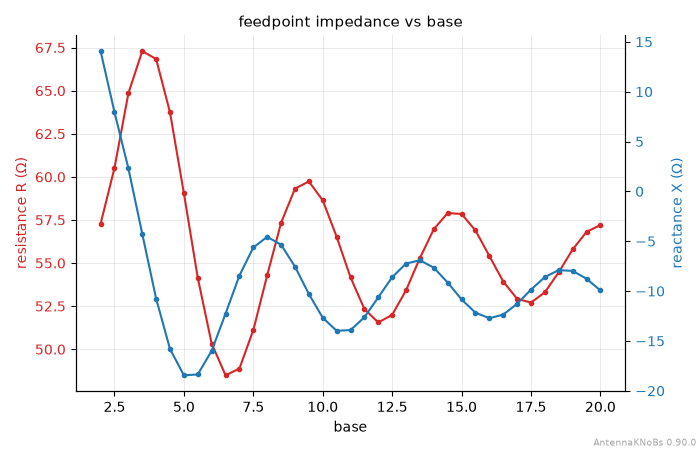
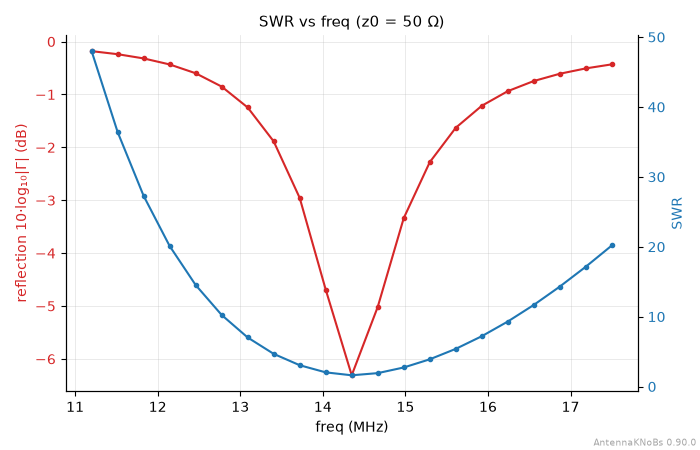
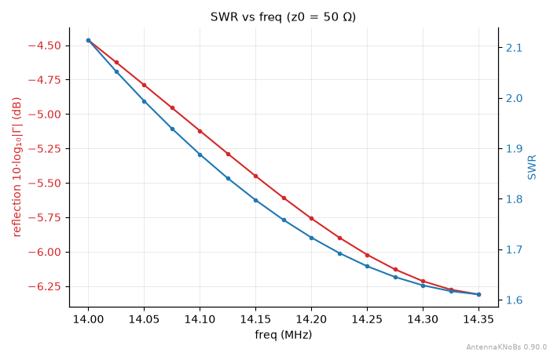
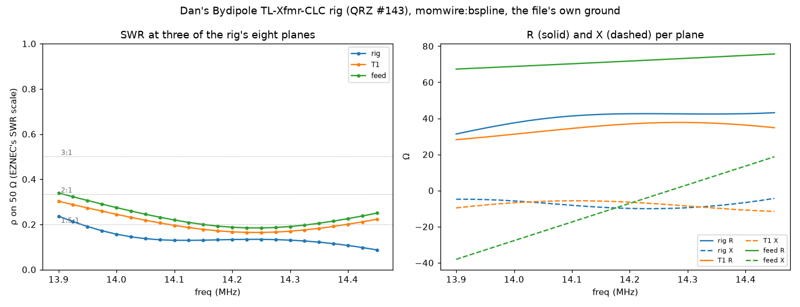
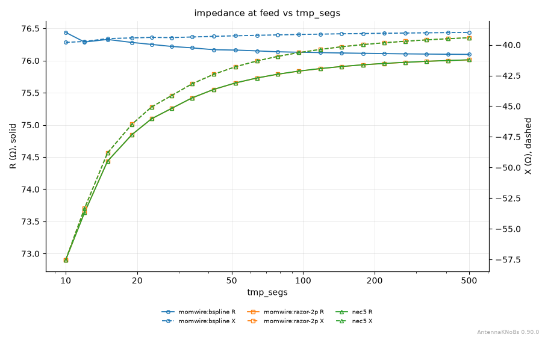
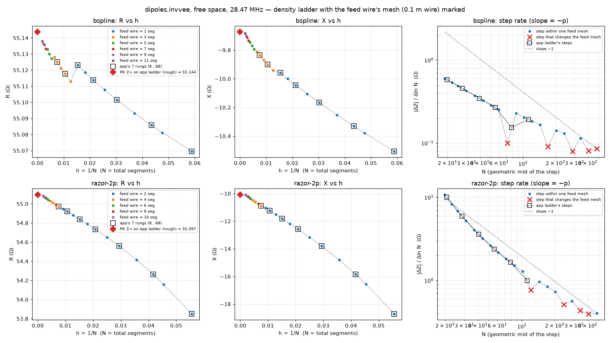

# Sweep framework: driving examples

Companion to `sweep-framework.md`. These are the seven concrete analyses that
axes A1–A4 (§4 there) must serve, chosen with Steve on 2026-09-28: E1–E3
from the catalog, E4–E7 from the last week's work with Dan. Each is real:
the charts, the numbers and the commands were produced from the released
antennaknobs 0.90.0 / momwire 0.66.0, except E7's chart (momwire main, free
space).

- **E1–E3** use the default inverted vee (`dipoles.invvee`, 28.47 MHz, 7 m
  apex, 31.7°) over average ground (εr 13, σ 0.005 S/m, Sommerfeld-Norton).
- **E4–E6** use Dan's own SimNEC files, on each file's own ground.

For each example:

- the question it answers;
- how it is drawn today;
- what neither tool can do yet;
- a *strawman* of the Python that would declare it, written against A1's
  option (a), declarative specs.

The strawman API is invented for this page. Its names are placeholders for A1
and A2 to decide, not a proposal.

---

## E1. Convergence, several engines

**The question.** Is the answer I am reading converged, and do the engines
agree once they are?



**Today.** The CLI draws it in one command (4.6 s):

```
NEC5_EXE=~/bin/nec5-licensed antennaknobs sweep --builder dipoles.invvee \
  --param nominal_nsegs --engine momwire:bspline,momwire:razor-2p,nec5 \
  --ground finite:13,0.005 --overlay
```

| engine | extrapolated Z |
|---|---|
| momwire:bspline | 48.912 − j8.016 |
| momwire:razor-2p | 48.874 − j8.405 |
| NEC-5 | 48.870 − j8.444 |

- razor-2p's extrapolation lands within 0.04 Ω of NEC-5's; B-spline's is
  0.43 Ω higher in X.
- B-spline is nearly flat across the ladder: R moves 0.05 Ω and X 0.7 Ω,
  against 1.0 Ω and 7.9 Ω for razor-2p and NEC-5. All three approach from
  below in X.
- (0.90.0 prints the older "Z*" label; the next release reads Z∞, with one
  estimator in both tools, #1782.)

**Missing.** The workbench runs a density sweep on the active slot only. It
cannot overlay engines.

**Strawman.**

```python
def build_analyses(self):
    return [
        analyses.convergence(
            engines=("momwire:bspline", "momwire:razor-2p", "nec5"),
            ground="finite:13,0.005",
        ),
    ]
```

**What it asks of the spec:**

- a list of engines, so an analysis is not bound to the active slot;
- a ground that can differ from the session's;
- no knob names at all, so the same spec applies to ANY design. That is the
  A2 case for a shared library: `analyses.convergence()` is generic.

---

## E2. Tune two knobs to a Z0

**The question.** Which length and apex angle make this inverted vee resonant
at 50 Ω, or at 75 Ω?



**Today.** Neither tool draws it. The chart above is a one-off script
(`scratch/sweep-examples/ex2_tuning.py`, 825 solves in 11.8 s on momwire
B-spline):

- **Left, a family:** R/X against length_factor, one pair per apex angle.
  Resonance moves little with angle; R falls steeply as the arms droop.
- **Right, a tuning map over (length_factor, angle):** the X = 0 contour
  against the R = 50 and R = 75 contours, over |Γ| on 50 Ω.
  - **50 Ω:** X = 0 crosses R = 50 at about 32.5° and length_factor 0.978. The
    catalog default (31.7°, 0.972) was tuned to 50 Ω, and the map agrees.
  - **75 Ω is not reachable at this height.** The largest resonant R is about
    66 Ω, flat (0°). The R = 75 contour never meets X = 0 in range.

**Missing.**

- A family of curves over a second knob is #1757's phase-2 step 2, not
  built.
- The 2-D map is named there only as "a later option".
- The workbench's optimizer finds a match but draws no picture of where the
  matches are.

**Strawman.**

```python
def build_analyses(self):
    lf = analyses.knob("length_factor", 0.90, 1.06, points=33)
    return [
        analyses.family(
            x=lf,
            step=analyses.knob("angle_deg", values=(0, 15, 30, 45, 60)),
            references={"R": (50, 75), "X": (0,)},
        ),
        analyses.tuning_map(
            x=lf, y=analyses.knob("angle_deg", 0, 60, points=25), z0=(50, 75)
        ),
    ]
```

**What it asks of the spec:**

- more than one swept knob;
- explicit values as well as ranges;
- reference lines (R = Z0, X = 0);
- views beyond R/X vs x: a map. So a spec names the view it wants, and one
  sweep can feed several views.
- The 75 Ω result is also a finding about composition. The next knob to reach
  for is height, which is E3.

---

## E3. R and X against mast height

**The question.** How does the feed impedance wander as I raise the antenna,
and where does it settle?



**Today.** Both tools draw it:

- the CLI: `antennaknobs sweep --builder dipoles.invvee --param base --range 2
  20 --npoints 37 --ground finite:13,0.005` (4.4 s);
- the workbench's Z-vs-parameter view, on `base`.

R and X oscillate with a period of about 5.3 m, which is λ/2 at 28.47 MHz:
the ground reflection's phase at the feed turns once per half wavelength of
height. The swing shrinks as the antenna rises: R runs 48–67 Ω near the
ground and 52–58 Ω above 13 m.

**Missing.**

- There's no reference to read the wiggle against: the free-space value, or
  the λ/2 marks.
- The ground cannot be compared inside one analysis (free vs average vs poor
  soil).
- The height knob has a different name in different designs (`base` here),
  so a generic "height sweep" needs the design to say which knob is its
  height.

**Strawman.**

```python
def build_analyses(self):
    return [
        analyses.knob(
            "base",
            2,
            20,
            points=37,
            grounds=("free", "finite:13,0.005", "finite:5,0.001"),
            references={"R": (50,), "X": (0,)},
        ),
    ]
```

**What it asks of the spec:**

- a comparison dimension that is not a knob (the ground). The same shape as
  E1's engines, so a spec may cross its sweep with engines OR grounds.
- Reuse across designs needs a knob ROLE ("height") or a design-provided
  name.

---

## E4. The frequency sweep, read the way EZNEC reads it

*From Dan, QRZ #158, #166 and #170. His SimNEC models carry their own
Generator sweep.*

**The question.** What is my 2:1 bandwidth, and where is the minimum?

**The antenna.** Dan's `snDipoleVarLenSegs.ssn`
(`scratch/dan-1716-numericparam/`). Its SimNEC Generator sweep is armed at
14.0–14.35 MHz in 15 points, and the workbench already reads it as the design's
measurement range (#1679).




**Today.**

- **The workbench** sweeps the file's own 14.0–14.35 MHz, on the 1−1/SWR or
  ρ (EZNEC) scale, with the threshold line and the 2:1 BW readout.
- **The CLI ignores the file's sweep.** `sweep --builder @file --swr` takes
  its ×0.8–×1.25 default, 11.2–17.5 MHz (top chart). The file's range needs
  `--range 14 14.35 --npoints 15` spelled out (bottom).
- The CLI has no ρ scale, threshold or bandwidth readout, and on 0.90.0 its
  reflection trace is still 10·log10\|Γ\| (20·log10 on main, #1775).

**What it asks of the spec:**

- the preset frequency sweep is an analysis like any other (#1757's first
  comment);
- its range may come FROM THE DESIGN (a deck's own sweep), so a spec's range
  can be "the design's";
- the scale, threshold and readouts are view options the spec can name.
- This is also the natural A4 test: a deck stub whose `build_analyses()` is
  generated from the deck's own Generator sweep.

---

## E5. One sweep, read at a network plane

*From Dan, QRZ #142 and #143: the LC tuner, and the TL-Xfmr-CLC rig.*

**The question.** What does the rig see across the band, compared with the
bare antenna?



**The antenna.** Dan's `Bydipole-TL-Xfmr-CLC.ssn`, which offers eight
measurement planes: `rig`, `C1`, `L1`, `C2`, `B`, `R1`, `T1` and `feed`. The
chart draws three of them (`scratch/sweep-examples/ex5_planes.py`, momwire
B-spline, the file's own ground).

| plane | best SWR | where | Z there |
|---|---|---|---|
| `rig` | 1.19 | 14.450 MHz (the sweep's edge) | 43.12 − j4.33 |
| `T1` (after the transformer) | 1.39 | 14.250 MHz | 37.59 − j7.39 |
| `feed` (the antenna) | 1.45 | 14.250 MHz | 72.51 − j1.90 |

Dan measured the rig at 50.01 + j0.003 Ω at 14.175 MHz in EZNEC. The
difference is the #143 adjudication again: his CLC was tuned to a 20-segment
antenna, and the match moves with the antenna's mesh (see E7).

**Today.**

- **The workbench** reads any one plane (its plane selector) but draws one at
  a time.
- **The CLI** has no plane option.

**What it asks of the spec:**

- WHERE Z is read is part of an analysis: a plane name, and possibly several
  in one chart;
- plane names become user-facing labels, and that is exactly where Dan was
  confused (#143: "feed" is the node after a shunt C in that circuit, not the
  bare antenna).

---

## E6. Convergence through a deck's own segment variable

*From Dan, QRZ #154, #163 and #166: the command he asked us for.*

**The question.** E1's question, on an imported deck whose density is ITS OWN
knob, not `nominal_nsegs`.

**The antenna.** Dan's `snDipoleVarLenSegs.ssn`. Its `JamSegments($segs)`
becomes the knob `tmp_segs` (#1716). Swept 10 → 500 in 20 log-spaced points on
three engines (33 s):

```
NEC5_EXE=~/bin/nec5-licensed antennaknobs sweep --builder @snDipoleVarLenSegs.ssn \
  --param tmp_segs --range 10 500 --npoints 20 --log \
  --engine momwire:bspline,momwire:razor-2p,nec5 --overlay
```



**Results.**

- razor-2p and NEC-5 lie on top of each other.
- B-spline stays flat to about 0.35 Ω from 10 segments up.

**Missing.** Because the knob is `tmp_segs`, the CLI gives no Z∞ and no
convergence table. The convergence treatment is keyed to the parameter's
NAME (`nominal_nsegs`), not to what the knob means.

**What it asks of the spec:**

- "convergence" is a ROLE a knob plays, which the design declares, like E3's
  "height";
- log spacing;
- two examples now need knob roles, which makes it an A2 requirement rather
  than a nicety.

---

## E7. Two segmentation methods on one convergence chart

*Steve, 2026-09-28: "we will probably like to compare different
segmentation methods on a convergence plot. That will really be comparing
different antennas on the same convergence plot."*

**The question.** Does the way I mesh the feed change what the ladder
converges to, and how cleanly?

**Spelling one: the catalog invvee.** A 0.1 m feed-gap wire, whose segment
count steps by two (1 → 3 → 5 on B-spline, 2 → 4 → 6 on razor-2p) while the
arms refine smoothly. The result is a sawtooth in R, and a "rough" Z∞ on the
default ladder (#1782 names the step).



(Free space, momwire main. Colour is the feed wire's segment count; the red X
marks each step that changes it.)

**Spelling two does not exist yet.** It is a feed that refines with the arms:
a port on one bent wire, the vertex-feed case #1767 deferred. A one-wire
spelling at angle 0 is not automatic either: the catalog invvee keeps its gap
wire at 0°.

**What it asks of the spec:**

- the comparison dimension can be THE DESIGN ITSELF: two spellings of one
  antenna, or two variants. That joins engines (E1, E6), grounds (E3) and
  planes (E5) as a thing a sweep is crossed with;
- the example also motivates the deferred #1767 vertex feed, since it is the
  missing second curve.

---

## What the seven ask of A1–A4, together

| need | examples | axis |
|---|---|---|
| list without solving, print back as code | all | A1 (a) |
| cross a sweep with engines | E1, E6 | A1 |
| … with grounds | E3 | A1 |
| … with measurement planes | E5 | A1 |
| … with designs / variants (spellings) | E7 | A1 |
| more than one swept knob; explicit values | E2 | A1 |
| name the views one sweep feeds (R/X, SWR scale, Smith, map) | E2, E4 | A1 |
| reference lines (Z0, X = 0, SWR threshold) | E2, E3, E4 | A1 |
| a range taken from the design (a deck's own sweep) | E4 | A1 / A4 |
| log spacing | E6 | A1 |
| generic across designs | E1 (no knobs) | A2 |
| knob ROLES the design declares (height, density) | E3, E6 | A2 |
| a deck stub generated from the deck's own sweep | E4 | A4 |
| one analysis leads to the next | E2 → E3 (75 Ω needs height), E5 → E7 (the match moves with the mesh) | later |

The seven cover every sweep the workbench runs today (frequency, density,
knob). Every "cross with" dimension is one of four kinds: engine, ground,
plane, or design.

Cost is not the obstacle on these designs: E2's 825-solve grid takes 12 s,
and E6's 60 solves on three engines take 33 s. Larger designs will need the
grid admitted by cost, as the hosted instance already does for sweeps.
